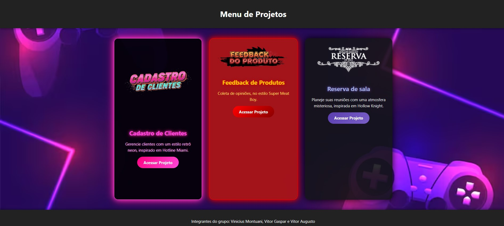

## Menu de Projetos PHP CRUD — Projeto Semestral SENAI

## Sobre este projeto 
Este consiste em um Menu de Projetos interativo, utilizando um sistema CRUD (Create, Read, Update, Delete) completo, desenvolvido em PHP com tema de jogos retrô e neon. Inspirado em clássicos como Hotline Miami, Super Meat Boy e Hollow knight cada projeto do menu tem sua própria identidade visual e temática de jogo.
O objetivo é simular uma plataforma onde múltiplos projetos podem ser gerenciados, adicionados, editados e excluídos dinamicamente através de uma interface web intuitiva, demonstrando o uso de banco de dados e as operações CRUD essenciais.
Tecnologias utilizadas
---

## Funcionalidades Principais
Possui 3 páginas que exemplificam o CRUD (Create, Read, Update e Delete), uma de agendamento de reuniões, outro de registro de clientes e outro de review de produto
Autores:

Vinicius Montuani

Vitor Augusto

<!-- Substitua "VitorAugustoGithub" pelo GitHub real do Vitor Augusto, se tiver. -->

<!-- Substitua "VitorAugustoLinkedIn" pelo LinkedIn real do Vitor Augusto, se tiver. -->
Vitor Gaspar

<!-- Substitua "VitorGasparGithub" pelo GitHub real do Vitor Gaspar, se tiver. -->

<!-- Substitua "VitorGasparLinkedIn" pelo LinkedIn real do Vitor Gaspar, se tiver. -->
Quer uma imagem de capa inspirada em jogos para o seu projeto?
Claro! Que tal algo que combine a estética neon/retro com a ideia de um menu de projetos?
Eu posso criar uma imagem para a seção "Capa do Projeto" com a estética que você mencionou.
